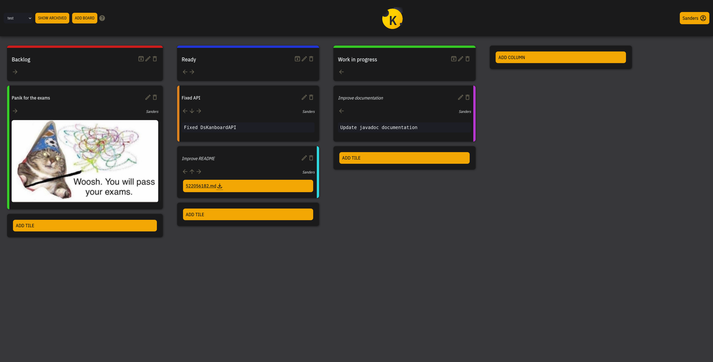

<p align="center">
  
</p>

# ds-kanboard 

## June 2021 Project, Distributed Systems Academic Year 2020-2021

The Project aims to implement a **_Kanban Board_** in the form of a 
web-application.



<!-- START doctoc generated TOC please keep comment here to allow auto update -->
<!-- DON'T EDIT THIS SECTION, INSTEAD RE-RUN doctoc TO UPDATE -->
**Table of Contents**

- [Contributors](#contributors)
- [Instructions](#instructions)
  - [Load and start](#load-and-start)
  - [Login](#login)
  - [Multiple boards](#multiple-boards)
  - [Persistence](#persistence)
  - [Tile types](#tile-types)
  - [Client caching](#client-caching)
  - [Tile swap](#tile-swap)
  - [Help page](#help-page)

<!-- END doctoc generated TOC please keep comment here to allow auto update -->


## Contributors
* Alessandro Riva, mat. ------ 
* Lorenzo Olearo, mat. ------ 


## Instructions 
### Load and start 
The committed sources consists in a Java Maven project thus they can be imported
into any Java IDE that supports this project managment tool. Once the project is
correctly imported, it is foundamental to resolve its dependencies throught the
attached pom.xml file.
Having resolved all the project's dependencies, the application can be run
throught the class `DsKanboardApplication.java`. If started successfully, the
*Kanban Board* can now be accessed at `localhost:8080`.


### Login 
At first access, the application will prompt the user for a username by
displaying a modal login window, this username will later be used by the system
to mark the author of each tile and their respective edits.
The active user can be changed at any time.


### Multiple boards
The system is capable of handling multiple boards, once they are created with
the dedicated button, the user can switch the displayed board by using a select
input. 


### Persistence
Each and every time any component of a board is updated by a user, the state
of the aforementioned board is saved throught a persistence system, in this
case, this is done by writing the changes to the server disk.
All the boards data are saved into the `~/ds-kanboard` folder of the running
server unless a different path is specified as shell argument.


### Tile types
The system rapresents three different types of tiles:

* Text tile
* Image tile
* File tile

The image of an *image tile* cannot exceed 15MB, if its resolution is above
900x900, the image will be risized by the server. The same maximum file size is
applied to files uploaded for any *file tile*.
It is important to note that once one of those tiles is created, it cannot be
converted in any of the other two types.


### Client caching
Through a non-standard header namely called `If-Modified-Since-Millis` added to
any request for a board, the server is able to process and answer the client 
request with the board. Depending on the value of the aforementioned header in
the client request, the server will return a different response:

* `NOT_MODIFIED` if the `If-Modified-Since-Millis` contained in the client
  request header **coincides** to the one saved by the server.
* The entire board if the `If-Modified-Since-Millis` contained in the client
  request header is **prior** to the one saved by the server.
  When the server sends the board to the client, it sets another non-standard
  header `Last-Modified-Millis`, this value is then saved by the client to be
  sent at any later request.
  
The format of the custom header is the following:

``` 
"EEE, dd MMM yyyy HH:mm:ss.SSS zzz" (e.g. "Sun, 20 Jul 1969 16:17:00.000 EDT")
```


### Tile swap
The user interface allows for tiles in the same column to be swapped and for any
tile in an active column to be moved active column. 
The user interface also allows for active columns in the same board to be
swapped.


### API endpoints

* Creates a new Board <br>
```
POST /api/boards/add/
```

* Returns the Board with id {boardID} <br>
```
GET /api/{boardID}/
```

* Returns the list of all the boards <br>
```
GET /api/boards/
```

* Creates a new Column in the Board with id {boardID} <br>
```
POST /api/{boardID}/columns/add/
```

* Returns the list of all the columns in a Board with id {boardID} <br>
```
GET /api/{boardID}/columns/
```

* Return the Column with title {columnTitle} in the Board with id {boardID} <br>
```
GET /api/{boardID}/{columnTitle}/
```

* Edits the Column with title {columnTitle} in the Board with id {boardID} <br>
```
PUT /api/{boardID}/{columnTitle}/edit/
```

* Creates a new Tile in the Column with title {columnTitle} in the board with id
{boardID} <br>
```
POST /api/{boardID}/{columnTitle}/tiles/add/
```

* Returns the list of all the tiles in the Column with title {columnTitle} in
the board with id {boardID} <br>
```
GET /api/{boardID}/{columnTitle}/tiles/
```

* Returns the Tile with id {tileID} in the Column with title {columnTitle} in the
Board with id {boardID} <br>
```
GET /api/{boardID}/{columnTitle}/{tileID}/
```

* Edits the Tile with id {tileID} in the Column with title {columnTitle} in the
Board with id {boardID} <br>
```
PUT /api/{boardID}/{columnTitle}/{tileID}/edit/
```

* Moves a Tile from a Column with title {columnTitle} to another in the same Board
with id {boardID} <br>
```
PUT /api/{boardID}/{columnTitle}/{tileID}/move/
```

* Swaps the position of two columns in the Board with id {boardID} <br>
```
PUT /api/{boardID}/columns/swap/
```

* Swaps the position of two tiles in the Column with title {columnTitle} in the
Board with id {boardID} <br>
```
PUT /api/{boardID}/{columnTitle}/tiles/swap/
```

* Deletes the Column with title {columnTitle} in the board with id {boardID} <br> 
```
DELETE /api/{boardID}/{columnTitle}/delete/
```

* Deletes the Tile with id {tileID} in the Column with title {columnTitle} in
the Board with id {boardID} <br>
```
DELETE /api/{boardID}/{columnTitle}/{tileID}/delete/
```

* Returns the list of all the boards without the columns data <br>
```
GET /api/boards/headers/
```


### Help page
By clicking on the question mark icon, the user will land on a help page where
all the UI elements are explained.
